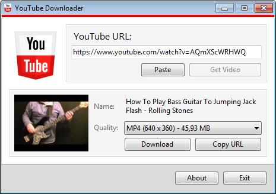
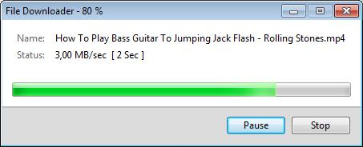

# Youtube Downloader

This program was written in C# code with Winforms UI in the .NET Framework version 4.0.
This program can download videos (even age restricted) from YouTube in any quality.

Many people have slow internet connections and they can not watch videos from YouTube, so I made this code to help those people to download YouTube videos to their PC's so they can watch the videos offline.

At first the program had been placed on Codeproject.com with the title "YouTube Downloader using C# .NET" written by "akramKamal" in the year 2012.

I worked on this project, because there are some cases the program does not work correctly. I use the decipher code from YoutubeExtractor and I get also some inspiration for age restricted videos.

[Inspiration for age restricted videos](https://www.quora.com/How-can-I-make-a-YouTube-video-downloader-web-application-from-scratch)

## Usage

First one had to install the msi-file to a windows computer (minimum Windows XP).
Then you can start "Youtube Downloader" via startmenu.

Copy the link (url) of a Youtube Video, you like to download, from your Internet browser.
Paste this link in "Youtube Downloader" via "Paste" button. You see the link in the TextBox "YouTube URL:". Then press "Get Video" button. After a while you can see a picture, name and quality of the video. You can select the quality you like for  this video.

Then press the "Download" button.
You get a "save file dialog" and after choosing a directory and optional choosing an other filename you will get a download dialog.
In the download dialog you can see the progress of the downloaded file.

## Installation

[Zipped installation file](https://github.com/harborsiem/YouTubeDownloader/files/1413758/YouTubeDownloader.zip)

